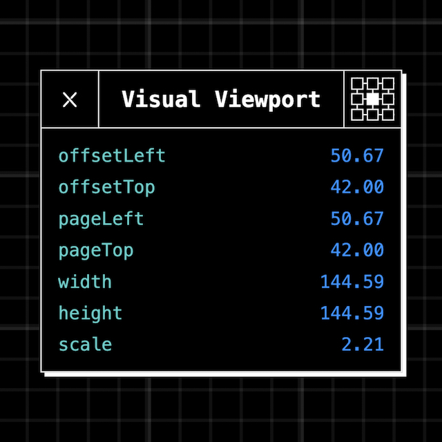

# Visual Viewport Debugger

Throw this standalone web component on a page for an overlay that logs the current visual viewport values. It always remains the same size and stays in the same position when scaling and panning;

The easiest way I can think of solving this is using the tables included in GitHub's flavored markdown.

To your specific example it would look something like this:

 


## Usage

```HTML
    <script type="module">
        import('./visual-viewport.js').then((mod) => {
            mod.VisualViewport.register();
        });
    </script>

    <button popovertarget="visual-viewport" popovertargetaction="show">Open Visual Viewport Tracker</button>

    <visual-viewport data-position="center-center" popover="manual" id="visual-viewport"></visual-viewport>
```

## Isn't the design a bit 1995?
I think you mean retro or nostalgic.

## Aren't there easier ways to get this info?
Yeah, the console is probably all you need. Live expressions also kinda work but [truncate large objects](https://issues.chromium.org/issues/359593396). Maybe there's a workaround I haven't figured out yet.

## Then why?
To learn. Through making it I got to play with the visual viewport, weird CSS math, light-dark(), custom elements, shadow DOM, adopted stylesheets, ESM, and popovers.

## Could this be a browser extension?
Probably, but I don't know how to do that... yet.